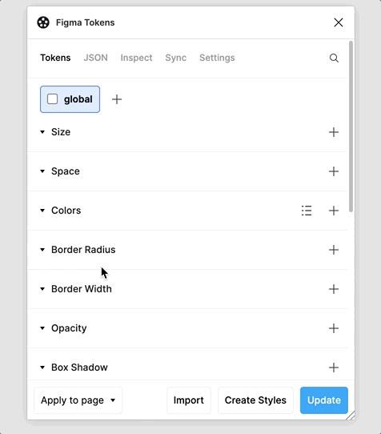
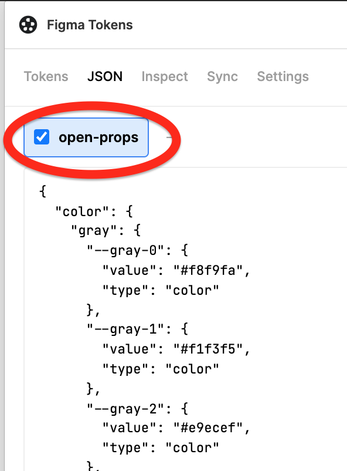

# figma-tokens-sync-example

Using [open-props](https://github.com/argyleink/open-props) in [figma-tokens](https://github.com/six7/figma-tokens).

Use this for the URL https://raw.githubusercontent.com/hchiam/figma-tokens-sync-example/main/open-props.figma-tokens.sync.json

Sync > URL > Add new credentials > Name and [URL](https://raw.githubusercontent.com/hchiam/figma-tokens-sync-example/main/open-props.figma-tokens.sync.json) > Save > Tokens

The JSON tab uses the top-level string `"open-props"` as the name, so if you're manually copy-pasting into the JSON tab, you can go one level down to things like `"color"`, `"sizing"`, etc. Note that it doesn't necessarily match the "Name" that you entered for credentials in the Sync tab.

