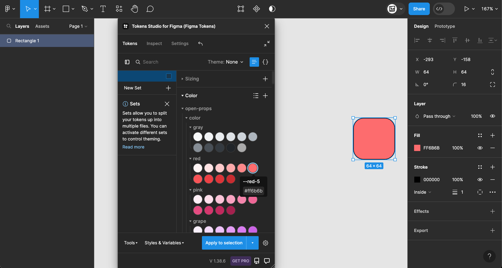
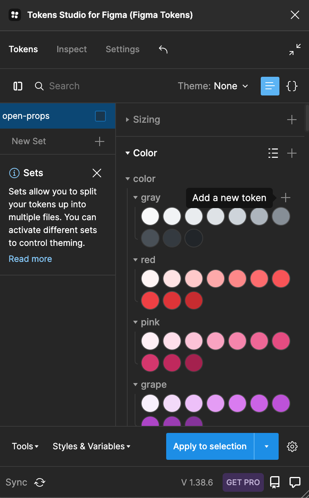

# figma-tokens-sync-example

Using [open-props](https://github.com/argyleink/open-props) in [figma-tokens](https://github.com/six7/figma-tokens), AKA Tokens Studio for Figma (Figma Tokens).

Use this URL:

```txt
https://raw.githubusercontent.com/hchiam/figma-tokens-sync-example/main/open-props.figma-tokens.sync.json
```

Or: (don't include "sync" in the link to omit top-level `"open-props": {`)

```txt
https://unpkg.com/open-props/open-props.figma-tokens.json
```

Settings > Sync providers > Add new > URL > Name and [URL](https://raw.githubusercontent.com/hchiam/figma-tokens-sync-example/main/open-props.figma-tokens.sync.json) > Save > Tokens.

<a href="https://www.youtube.com/watch?v=fE9RgBHmGPQ">
  
</a>

[See on YouTube](https://www.youtube.com/watch?v=fE9RgBHmGPQ)

However, doing this makes the Open Props tokens read-only, so you can't edit the JSON or add custom tokens right within the open-props list, unless you pasted the JSON content in.

So if you instead manually copy-paste the JSON contents into Tokens > `{}` JSON view > Save JSON, then you can also add new tokens in the `{}` JSON view or in the Listing view.

<a href="https://www.youtube.com/watch?v=pdxj41pnaOk">
  
</a>

[See on YouTube](https://www.youtube.com/watch?v=pdxj41pnaOk)
